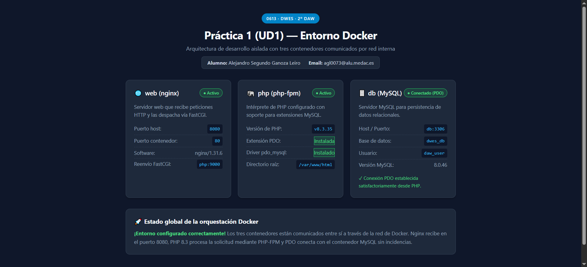

# Práctica 1 (UD1) — Arranque del entorno de desarrollo con Docker

**Módulo:** 0613 · Desarrollo Web en Entorno Servidor  
**Curso:** 2º DAW A  
**Alumno:** Alejandro Segundo Ganoza Leiro  

---

## 📌 Descripción del Proyecto

Este proyecto cambia el modelo clásico sólido (como XAMPP) por un entorno de desarrollo profesional basado en **Docker**.

A través de un único archivo `docker-compose.yml`, se consta de tres contenedores independientes conectados entre sí mediante una red interna tipo *bridge*:

1. **`web` (Nginx):** Servidor web que atiende las peticiones HTTP entrantes en el puerto `8080` y las reenvía al servicio PHP a través del protocolo FastCGI.
2. **`php` (PHP-FPM 8.3):** Contenedor construido a partir de un `Dockerfile` personalizado sobre `php:8.3-fpm`, al cual se le añade la extensión `pdo_mysql` para habilitar la conexión a bases de datos.
3. **`db` (MySQL 8.0):** Servidor de base de datos relacional que almacena la información (`db_data`) para mantener los datos tras reiniciar los contenedores.

---

## 📂 Estructura del Repositorio

```text
├── docker-compose.yml    # Definición y orquestación de los 3 servicios
├── nginx/
│   └── default.conf      # Configuración del servidor Nginx y FastCGI
├── php/
│   └── Dockerfile        # Imagen personalizada de PHP 8.3 con pdo_mysql
├── src/
│   └── index.php         # Script PHP con interfaz de verificación y prueba PDO
├── .gitignore            # Archivos y carpetas ignorados por Git
└── README.md             # Documentación del proyecto
```

---

## 🚀 Instrucciones de Puesta en Marcha

### Requisitos previos
- Tener instalado **Docker Desktop** y comprobar que el motor está en ejecución.
- Tener instalado **Git**.

### 1. Clonar el repositorio
```bash
git clone https://github.com/agl0073/Pr-ctica-1-UD1-Arranque-del-entorno-de-desarrollo-con-Docker.git
cd "Práctica 1 (UD1) — Arranque del entorno de desarrollo con Docker"
```

### 2. Levantar los contenedores
Ejecuta el siguiente comando en la raíz del proyecto para descargar las imágenes, construir el contenedor PHP y levantar los servicios en segundo plano:

```bash
docker compose up -d
```

### 3. Verificar el funcionamiento
Abre tu navegador web y accede a:
```
http://localhost:8080
```

Se mostrará la página de estado donde se verifica:
- La correcta recepción en Nginx por el puerto 8080.
- La ejecución en PHP 8.3 con `pdo_mysql` habilitado.
- La conexión con éxito al contenedor MySQL mediante **PDO**.

### 4. Parar el entorno
Cuando desees detener los contenedores sin perder los datos de la base de datos:
```bash
docker compose down
```

---

## 📸 Captura de Pantalla del Resultado

A continuación se muestra la captura de pantalla con el entorno en ejecución en `http://localhost:8080`:



Página Web realizada con IA
