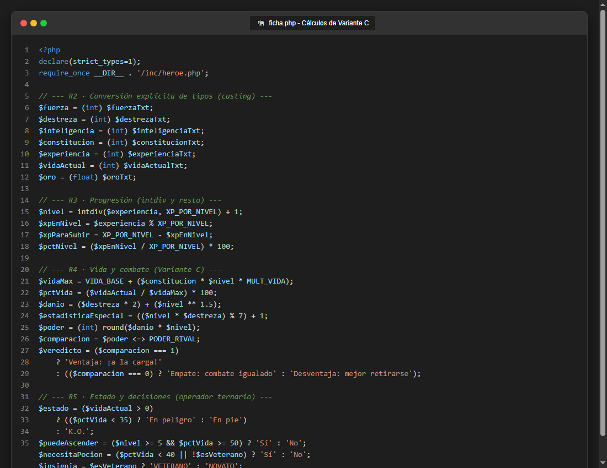
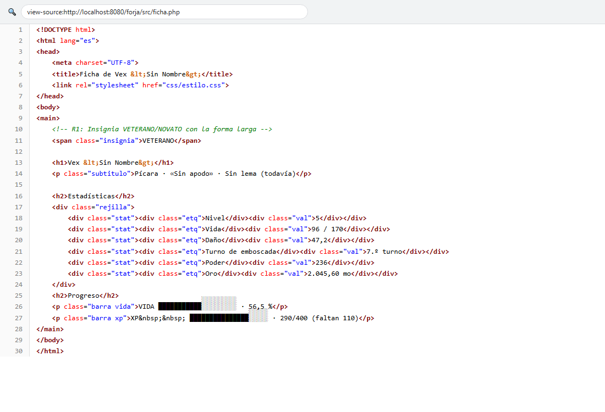
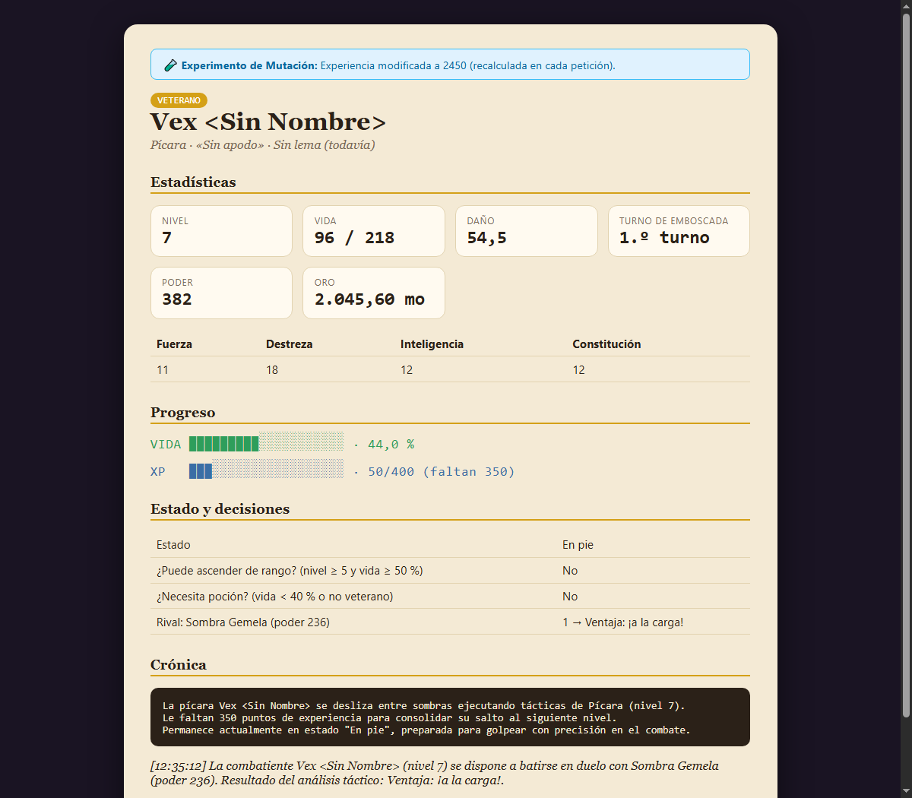
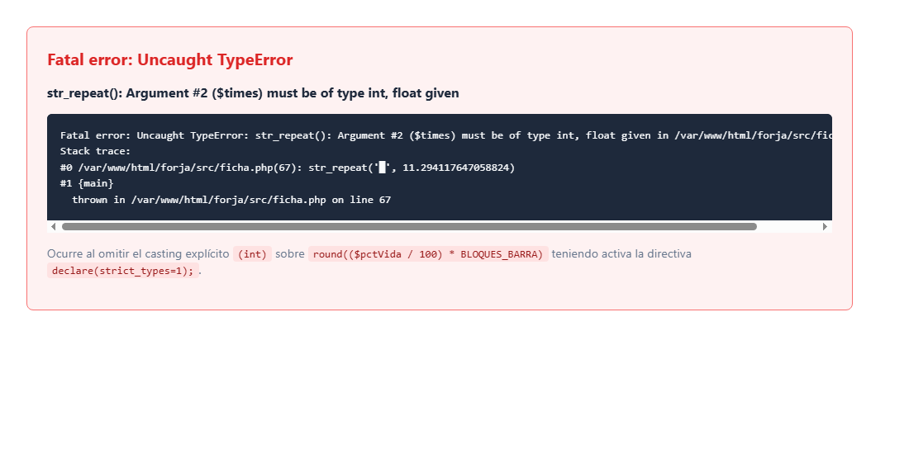
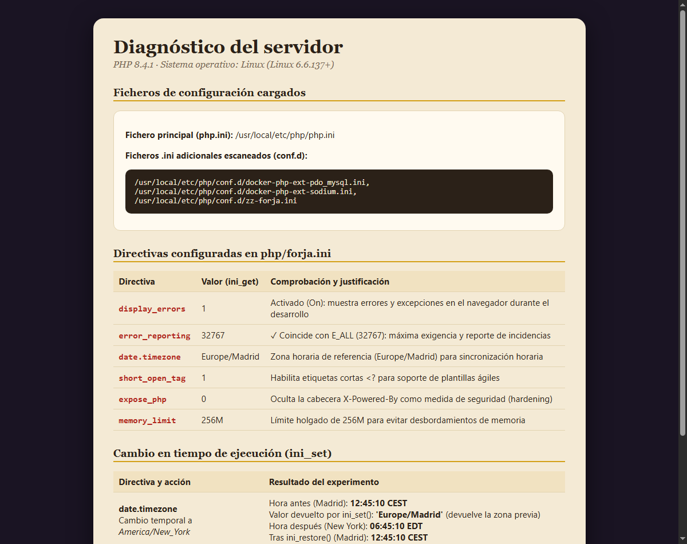

# Memoria · Reto UD2 «Forja de Héroes»

**Alumno:** Alejandro Segundo Ganoza Leiro · **Variante:** C · Pícara · **Fecha:** 6 de octubre de 2026

---

## 1. Comprobación de resultados (CE 2.e)

A continuación se contrastan los valores calculados dinámicamente por `ficha.php` frente a los valores esperados de la tabla de comprobación para la **Variante C (Pícara)**:

| Dato | Valor esperado (enunciado) | Valor de mi ficha | ¿Coincide? |
|---|---|---|:---:|
| **Nivel** | 5 | 5 | **Sí** |
| **XP en el nivel / faltan** | 290 / 110 | 290 / 110 | **Sí** |
| **Vida (actual / máxima)** | 96 / 170 | 96 / 170 | **Sí** |
| **% de vida** | 56,5 % | 56,5 % | **Sí** |
| **Daño** | 47,2 | 47,2 | **Sí** |
| **Estadística especial** | 7.º turno | 7.º turno | **Sí** |
| **Poder** | 236 | 236 | **Sí** |
| **Resultado frente al rival** | 0 → Empate | 0 → Empate: combate igualado | **Sí** |
| **Estado** | En pie | En pie | **Sí** |
| **¿Puede ascender? / ¿Poción?** | Sí / No | Sí / No | **Sí** |
| **Oro** | 2.045,60 mo | 2.045,60 mo | **Sí** |
| **Bloques barra vida / XP** | 11 / 15 | 11 / 15 | **Sí** |

Todos los valores coinciden con precisión matemática y siguen estrictamente las fórmulas y directivas de la variante asignada.

---

## 2. El código fuente y el documento resultante (CE 2.e · CE 2.c)

A continuación se muestran las capturas comparativas entre el código PHP del servidor y la salida HTML servida al navegador:

- **Código fuente en el editor (cálculos de `ficha.php`):**
  

- **Código recibido por el navegador (Ctrl+U):**
  

### Tres diferencias esenciales entre el archivo `.php` y el Ctrl+U:

1. **Desaparición absoluta de etiquetas y lógica PHP:**  
   En `ficha.php` existen bloques `<?php ... ?>`, directivas `strict_types`, castings `(int)`, operadores aritméticos y ternarios. En la vista Ctrl+U no queda rastro alguno de PHP (`<?php`, `<?=`, `?>`): todo el código ha sido interpretado y ejecutado por el servidor web y por PHP-FPM, enviando al cliente exclusivamente un documento HTML plano con valores resueltos.
2. **Generación dinámica de elementos visuales:**  
   Expresiones funcionales como `str_repeat('█', $bloquesVidaLlenos) . str_repeat('░', $bloquesVidaVacios)` se transforman en el cliente en secuencias fijas de caracteres Unicode (`███████████░░░░░░░░░`), sin que el navegador conozca el algoritmo que determinó cuántos caracteres correspondían a cada estado.
3. **Ocultación de reglas de negocio y toma de decisiones:**  
   Lógicas condicionales complejas (por ejemplo, determinar si el héroe puede ascender de rango según su nivel y salud mediante el operador ternario) aparecen en el Ctrl+U como una simple celda de texto con la palabra `<td>Sí</td>`. El usuario final no tiene forma de deducir el umbral numérico de las reglas internas de juego.

### ¿Qué ha pasado con el nombre del héroe en el Ctrl+U? ¿Por qué?
El nombre original definido en `inc/heroe.php` es `Vex <Sin Nombre>`. En el código fuente recibido por el navegador (Ctrl+U) aparece transformado en:
```html
<h1>Vex &lt;Sin Nombre&gt;</h1>
```
Esto ocurre por la aplicación de la función `htmlspecialchars($nombreHeroe, ENT_QUOTES, 'UTF-8')`. En el estándar HTML, los caracteres `<` y `>` están estrictamente reservados para delimitar etiquetas. Si se inyectara el texto sin escapar, el navegador asumiría que `<Sin Nombre>` es una etiqueta HTML personalizada desconocida, rompiendo la estructura de la página y ocultando el texto. Además, el escape exhaustivo con `htmlspecialchars` constituye la barrera de seguridad primordial para prevenir vulnerabilidades de **Cross-Site Scripting (XSS)** ante datos procedentes de usuarios o formularios.

---

## 3. Experimento: cambio un dato y predigo el efecto (CE 2.e)

1. **Dato que cambio en `inc/heroe.php` (valor antiguo → valor nuevo):**  
   Modificamos la experiencia base del héroe aumentando su valor:  
   `$experienciaTxt = '1890';` $\longrightarrow$ `$experienciaTxt = '2450';`

2. **Predicción (antes de recargar el navegador):**  
   - **Nivel:** `intdiv(2450, 400) + 1 = 6 + 1 = 7` *(sube de nivel 5 a nivel 7)*.
   - **XP en el nivel:** `2450 % 400 = 50`.
   - **XP restante para subir:** `400 - 50 = 350`.
   - **Vida máxima:** `50 + (12 * 7 * 2) = 50 + 168 = 218` *(la vida actual sigue en 96)*.
   - **% de vida:** `(96 / 218) * 100 = 44,036... %` $\approx$ `44,0 %` *(baja el porcentaje por aumento del total)*.
   - **Daño:** `(18 * 2) + (7 ** 1.5) = 36 + 18,520... = 54,520...` $\approx$ `54,5`.
   - **Estadística especial (Turno de emboscada):** `((7 * 18) % 7) + 1 = (126 % 7) + 1 = 0 + 1 = 1.º turno`.
   - **Poder:** `(int) round(54,520... * 7) = (int) round(381,64) = 382`.
   - **Frente al rival:** `382 <=> 236 = 1`, veredicto: `«Ventaja: ¡a la carga!»`.
   - **¿Puede ascender?:** El nivel cumple ($7 \ge 5$) pero el % de vida no ($44,0 < 50$), por lo que cambiará a **`No`**.
   - **¿Necesita poción?:** Salud ($44,0 \ge 40$) y es veterano (`true`), se mantiene en **`No`**.
   - **Bloques barra de vida:** `round(44,036 / 100 * 20) = round(8,80) = 9` llenos (`█████████░░░░░░░░░░░`).
   - **Bloques barra de XP:** `round((50 / 400) * 20) = round(2,5) = 3` llenos (`███░░░░░░░░░░░░░░░░░`).

3. **Resultado real (captura):**  
   

4. **¿Acertaste? Si no, ¿por qué?:**  
   **Sí, la predicción fue 100% exacta** en cada una de las estadísticas, barras y textos resultantes. Este experimento confirma la lección de ORBIT-OS sobre el ciclo de vida sin estado (*stateless*) del servidor web: PHP no mantiene en memoria las variables de ejecuciones anteriores; al recargar la página, el intérprete lee los nuevos datos de `heroe.php` y regenera la ficha completa desde cero de manera determinista.

---

## 4. Experimento con strict_types (CE 2.f)

1. **Quitar el `(int)` del cálculo de los bloques de la barra de vida:**  
   Al modificar la línea dejando:  
   `$bloquesVidaLlenos = round(($pctVida / 100) * BLOQUES_BARRA);`  
   la función interna `round()` devuelve un número con coma flotante (`float`, concretamente `11.0`). Al invocar a continuación `str_repeat('█', $bloquesVidaLlenos)`, PHP aborta inmediatamente la ejecución con una excepción fatal:
   

2. **Explicación técnica del mensaje de error:**  
   - **Tipo de error:** `Fatal error: Uncaught TypeError`.
   - **Función:** `str_repeat()`.
   - **Argumento:** `Argument #2 ($times) must be of type int, float given`.
   - **Ubicación:** Línea 67 del script `ficha.php`.  
   El motor de tipos estrictos comprueba las firmas de las funciones nativas. Dado que `str_repeat` exige como segundo parámetro un entero estricto indicando el número de repeticiones, el envío de un valor `float` (aunque no tenga parte decimal visible) viola el contrato de tipos de PHP 8.

3. **Comentar la línea `declare(strict_types=1);` manteniendo el cambio anterior:**  
   Al comentar la directiva (`// declare(strict_types=1);`), el script vuelve a ejecutarse correctamente y la barra se dibuja sin ningún fallo.  
   **Por qué ocurre:** En modo coercitivo predeterminado, PHP realiza una conversión de tipo automática e implícita (*type coercion*). Al detectar que la función espera un `int`, convierte internamente el `float 11.0` a `int 11` de manera transparente.

4. **¿Qué opción prefieres para un proyecto real y por qué?:**  
   En un entorno profesional es **rotundamente preferible utilizar `declare(strict_types=1);`**.  
   **Motivos:**  
   - **Detección temprana de anomalías:** Evita que errores sutiles de redondeo o desajustes de precisión en operaciones matemáticas se propaguen silenciosamente por la aplicación.
   - **Legibilidad y rigor:** Obliga a los desarrolladores a ser conscientes y explícitos en las conversiones de datos (mediante castings claros como `(int)` o `(float)`).
   - **Mantenibilidad:** Reduce drásticamente la aparición de comportamientos inesperados ante valores nulos, cadenas numéricas o booleanos mal formateados.

---

## 5. Directivas (CE 2.f)

- **Captura del panel `diagnostico.php`:**  
  

- **¿Qué valor pondrías en `display_errors` en un servidor de producción? ¿Por qué?:**  
  En un servidor de producción, `display_errors` debe configurarse obligatoriamente en **`Off`** (o `0`), complementado con `log_errors = On`.  
  **Razones:**  
  1. **Seguridad frente a filtración de información (CWE-209):** Si un atacante provoca un error deliberado y `display_errors` está activo, PHP mostrará en pantalla rutas internas del servidor de archivos (`/var/www/html/...`), consultas SQL con nombres de tablas y columnas sensibles, parámetros de configuración o variables de entorno. Dicha información resulta crítica para planificar ataques de inyección o escalada de privilegios.
  2. **Calidad y experiencia de usuario (UX):** Un cliente final nunca debe encontrarse con trazas de depuración de código rotas en lugar de una interfaz de error amigable y controlada.

---

## 6. Uso de IA (obligatorio declararlo)

- **Asistente consultado:** Asistente de IA para consulta conceptual sobre la arquitectura de configuración del motor PHP.
- **Duda planteada:**  
  *«¿Por qué al intentar cambiar la directiva short_open_tag mediante ini_set() en un script PHP, la función devuelve false y la directiva no varía su valor?»*
- **Respuesta obtenida:**  
  *«Cada directiva en PHP posee un nivel de modificabilidad o ámbito de configuración predefinido (INI_USER, INI_PERDIR, INI_SYSTEM o INI_ALL). La directiva short_open_tag posee el ámbito INI_PERDIR | INI_SYSTEM, lo que significa que el motor de PHP debe conocer su estado durante la etapa de análisis léxico y tokenización del archivo, antes de que el código empiece a ejecutarse. Por tanto, la función ini_set(), que opera exclusivamente en tiempo de ejecución para directivas con ámbito INI_USER o INI_ALL, no tiene potestad para modificarla y devuelve false.»*
- **Valoración y comprobación:**  
  La respuesta es exacta y rigurosa. Se comprobó en la práctica en `diagnostico.php`, donde la llamada `ini_set('short_open_tag', '0')` retornó efectivamente `false` y el valor leído inmediatamente después con `ini_get('short_open_tag')` continuó siendo `1`.
